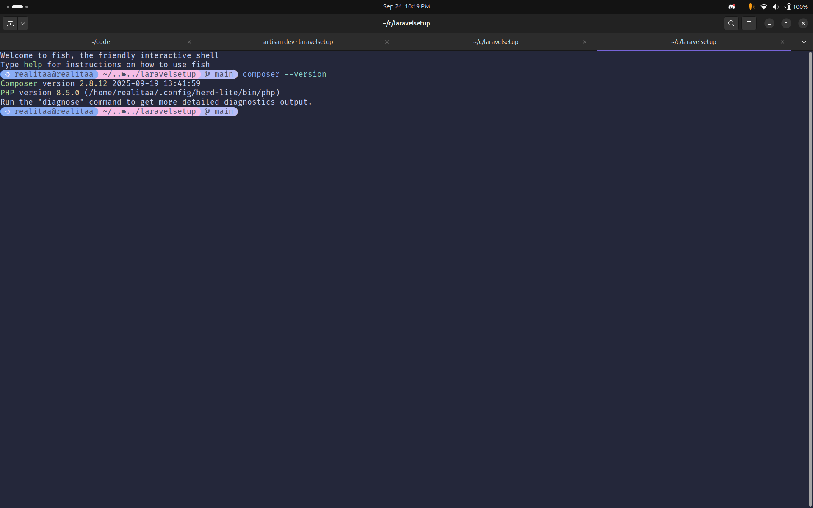
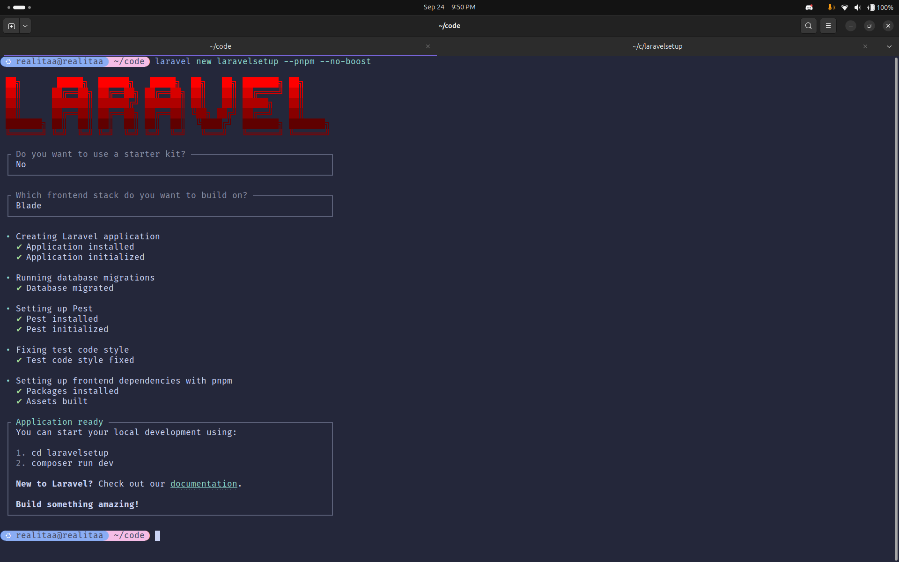
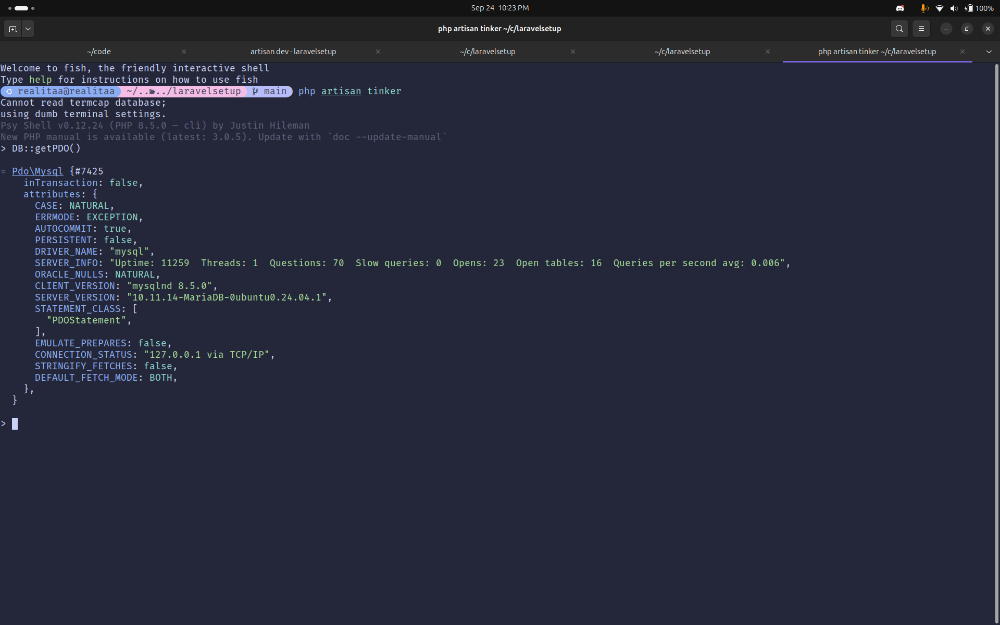
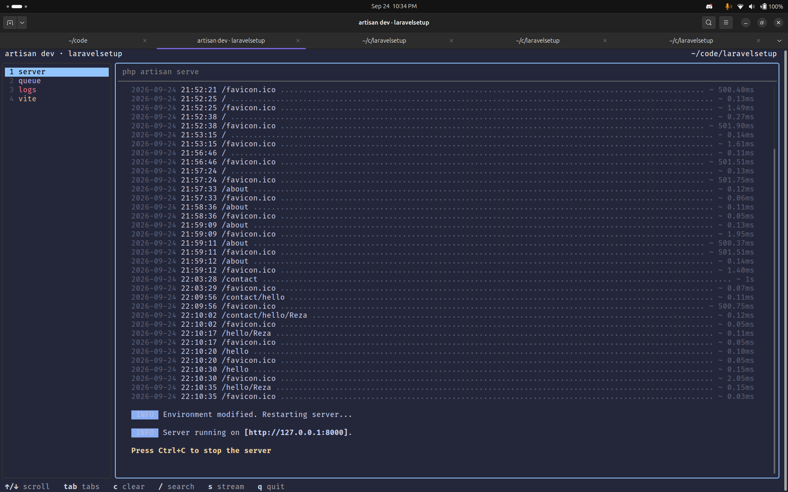
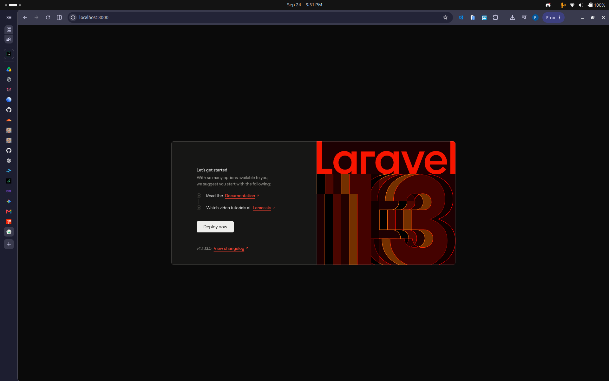
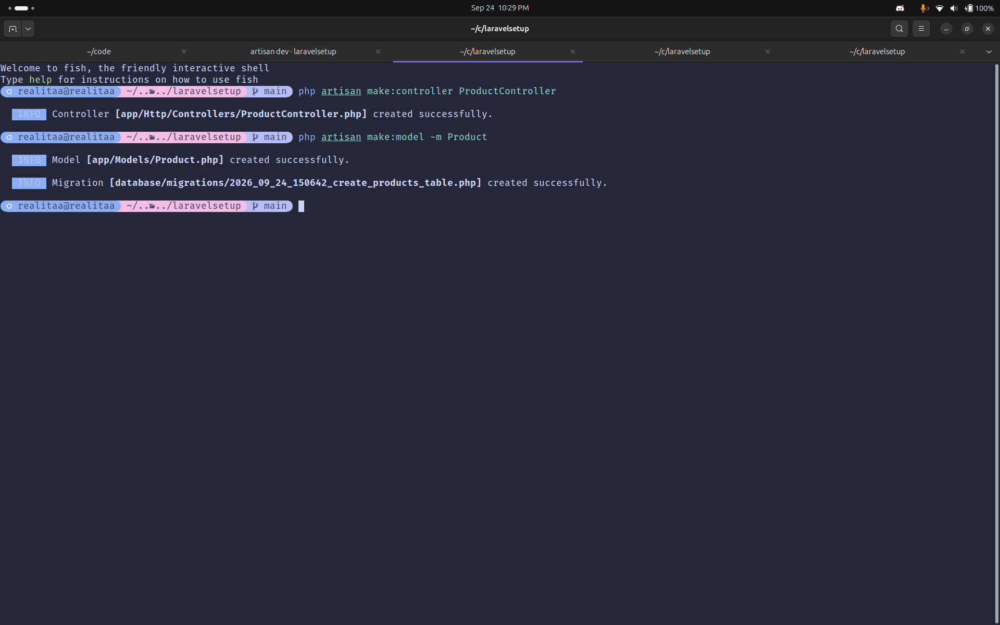

# Laravel Setup — Tugas Pertemuan 9: Setup & Dasar Routing Blade

[](https://github.com/Realitaa/TugasWeb-P9-LaravelSetup/actions/workflows/tests.yml)

Repositori ini berisi implementasi lengkap **Tugas Rutin 9 — Setup Laravel** pada mata kuliah Pemrograman Web. Proyek ini dibangun menggunakan framework **Laravel 13**, **PHP 8.5**, **Tailwind CSS v4** via **Vite 8**, serta pengujian otomatis berbasis **Pest PHP**. Memenuhi seluruh kriteria wajib (8/8) dan fitur bonus (2/2) termasuk routing kustom, rendering view Blade dengan data dinamis, pemanfaatan Artisan CLI generator, pengujian otomatis berstandar industri, serta CI/CD workflow GitHub Actions.

- **Repository**: [https://github.com/Realitaa/TugasWeb-P9-LaravelSetup](https://github.com/Realitaa/TugasWeb-P9-LaravelSetup)

---

## 📌 Pemenuhan Kriteria Tugas (Tugas Rutin 9 — Setup Laravel)

Berikut matriks pemenuhan lengkap terhadap seluruh kriteria wajib (**8/8 Requirements**) serta seluruh fitur bonus (**2/2 Bonus**):

### 📊 Matriks Kesesuaian Kriteria Wajib (8/8)

| No | Kriteria Wajib | Status | Bukti & Lokasi Implementasi dalam Proyek |
|:--:|:---|:---:|:---|
| 1 | **Install Composer & buat project (`composer create-project`)** | ✅ **Terpenuhi** | Bukti tangkapan layar instalasi Composer ([`docs/composer-installed.png`](docs/composer-installed.png)) dan inisialisasi proyek Laravel ([`docs/project-creation.png`](docs/project-creation.png)). |
| 2 | **Buat DB di phpMyAdmin & konfigurasi `.env` (MySQL)** | ✅ **Terpenuhi** | Konfigurasi database MySQL pada berkas [`.env`](.env), dibuktikan dengan screenshot pengujian koneksi database ([`docs/configured-env-for-db-conn.png`](docs/configured-env-for-db-conn.png)). |
| 3 | **`artisan serve` / `artisan dev` berjalan + screenshot welcome page** | ✅ **Terpenuhi** | Server lokal berhasil dijalankan dengan `php artisan dev` ([`docs/artisan-dev.png`](docs/artisan-dev.png)) dan tampilan peramban halaman *welcome* default terpasang rapi ([`docs/welcome-page.png`](docs/welcome-page.png)). |
| 4 | **3 route custom (`/`, `/about`, `/contact`) return Blade view** | ✅ **Terpenuhi** | Didefinisikan pada [`routes/web.php`](routes/web.php) yang merender view [`resources/views/welcome.blade.php`](resources/views/welcome.blade.php), [`resources/views/about.blade.php`](resources/views/about.blade.php), dan [`resources/views/contact.blade.php`](resources/views/contact.blade.php). Teruji mengembalikan HTTP status 200 OK di [`tests/Feature/RequirementTest.php`](tests/Feature/RequirementTest.php). |
| 5 | **View menampilkan data dinamis (array dari route)** | ✅ **Terpenuhi** | Rute `/about` mengirimkan integer dinamis acak (`['x' => random_int(1, 10)]`), rute `/contact` mengirimkan associative array identitas diri, dan view mencetak data melalui direktif Blade `@for` dan `@foreach`. Diuji secara komprehensif pada [`tests/Feature/RequirementTest.php`](tests/Feature/RequirementTest.php). |
| 6 | **Gunakan `make:controller` & `make:model -m` minimal 1x** | ✅ **Terpenuhi** | Dibuktikan dengan screenshot eksekusi perintah Artisan CLI ([`docs/artisan-usage.png`](docs/artisan-usage.png)). Berkas Controller [`app/Http/Controllers/ProductController.php`](app/Http/Controllers/ProductController.php), Model [`app/Models/Product.php`](app/Models/Product.php), dan berkas migrasi [`database/migrations/2026_09_24_150642_create_products_table.php`](database/migrations/2026_09_24_150642_create_products_table.php) telah terbentuk di direktori proyek. |
| 7 | **README: langkah install + penjelasan struktur folder** | ✅ **Terpenuhi** | Berkas [`README.md`](README.md) memuat dokumentasi mendalam, langkah instalasi lokal langkah demi langkah, serta direktori peta arsitektur Laravel yang terperinci. |
| 8 | **Remote Repository GitHub: `TugasWeb-P9-LaravelSetup`** | ✅ **Terpenuhi** | Repository dipublikasikan dengan penamaan remote resmi: `https://github.com/Realitaa/TugasWeb-P9-LaravelSetup`. |

---

### ⭐ Matriks Kesesuaian Kriteria Bonus (2/2)

| No | Fitur Bonus | Status | Bukti & Lokasi Implementasi dalam Proyek |
|:--:|:---|:---:|:---|
| 1 | **Styling halaman welcome dengan Tailwind CSS** | ⭐ **Terpenuhi** | View [`resources/views/welcome.blade.php`](resources/views/welcome.blade.php) menggunakan styling modern Tailwind CSS bawaan framework yang dikompilasi langsung melalui `@tailwindcss/vite` ([`package.json`](package.json)), responsif, mendukung tema gelap/terang, dan bebas dari overhead CDN eksternal. |
| 2 | **Route parameter `/hello/{nama}`** | ⭐ **Terpenuhi** | Rute `Route::get('/hello/{nama}', ...)` di [`routes/web.php`](routes/web.php) meneruskan parameter URL ke [`resources/views/hello.blade.php`](resources/views/hello.blade.php) untuk menampilkan sapaan dinamis `<h1>Hello {{ $nama }}</h1>`. Diverifikasi secara otomatis dengan Pest dataset test di [`tests/Feature/RequirementTest.php`](tests/Feature/RequirementTest.php). |

---

## 📸 Dokumentasi & Bukti Tangkapan Layar (Screenshots)

Berikut dokumentasi bukti pelaksanaan langkah-langkah penugasan yang tersimpan di direktori [`docs/`](docs/):

### 1. Instalasi Composer & Pembuatan Proyek Baru
Verifikasi ketersediaan Composer pada lingkungan sistem operasi serta proses pembentukan kerangka kerja proyek Laravel baru (`laravel new`):



### 2. Konfigurasi Environment & Koneksi Database MySQL
Konfigurasi kredensial koneksi database MySQL pada berkas `.env` dan verifikasi keberhasilan koneksi ke server database:


### 3. Eksekusi Server Lokal (`php artisan dev`)
Menjalankan server pengembangan terintegrasi menggunakan perintah `php artisan dev` yang memproses HTTP server dan asset bundler secara bersamaan:


### 4. Tampilan Halaman Welcome Page (Tailwind CSS)
Halaman awal (*Welcome Screen*) aplikasi Laravel yang telah terkompilasi dengan antarmuka responsif Tailwind CSS:


### 5. Penggunaan Artisan Code Generator
Bukti eksekusi perintah CLI `php artisan make:controller ProductController` dan `php artisan make:model Product -m` di terminal:


---

## 🔍 Penjelasan Rinci Implementasi Kriteria Tugas

### 1. Instalasi Composer & Setup Proyek Laravel
Proyek diinisialisasi menggunakan Composer versi 2.8+ dengan arsitektur Laravel versi terbaru (Laravel 13 / PHP 8.5). Pengelolaan dependensi ditangani secara deklaratif melalui [`composer.json`](composer.json) untuk backend dan [`package.json`](package.json) dengan Vite 8 untuk frontend tooling.

### 2. Konfigurasi Database MySQL & Environment `.env`
Konfigurasi database diarahkan ke database MySQL bernama `inventaris`:
```env
DB_CONNECTION=mysql
DB_HOST=127.0.0.1
DB_PORT=3306
DB_DATABASE=inventaris
DB_USERNAME=root
DB_PASSWORD=root
```
Koneksi berhasil diverifikasi melalui driver PDO MySQL Laravel, menjamin kesiapan aplikasi untuk proses migrasi skema tabel.

### 3. Menjalankan Server Pengembangan Lokal
Aplikasi memanfaatkan script concurrent `php artisan dev` (atau `composer dev`) yang mengeksekusi PHP internal web server pada `http://127.0.0.1:8000` sekaligus hot module reloading (HMR) melalui Vite.

### 4. Custom Routes & Blade Views
Tiga rute utama didefinisikan pada [`routes/web.php`](routes/web.php) yang mengembalikan Blade view:
- **`GET /`**: Mengembalikan view [`resources/views/welcome.blade.php`](resources/views/welcome.blade.php) yang berisi landing page default interaktif berdesain Tailwind CSS.
- **`GET /about`**: Mengembalikan view [`resources/views/about.blade.php`](resources/views/about.blade.php).
- **`GET /contact`**: Mengembalikan view [`resources/views/contact.blade.php`](resources/views/contact.blade.php).

### 5. Passing Data Dinamis (Array & Integer) ke Blade View
- **Rute `/about`**: Mengirimkan variabel `x` dengan nilai acak dari `random_int(1, 10)`. Di dalam view [`resources/views/about.blade.php`](resources/views/about.blade.php), perulangan `@for` mencetak paragraf *Lorem ipsum* sebanyak nilai `x`, diakhiri dengan pesan status:
  ```blade
  @for ($i = 1; $i <= $x; $i++)
      <p>Lorem ipsum dolor sit amet consectetur adipisicing elit. Consequuntur, autem.</p>
  @endfor
  <p>Paragraf lorem telah di tampilkan sebanyak {{ $x }} kali.</p>
  ```
- **Rute `/contact`**: Mengirimkan array asosiatif berisi data identitas diri:
  ```php
  Route::get('/contact', function () {
      return view('contact', [
          'data' => [
              'name' => 'Reza Mulia Putra',
              'class' => 'PSIK25B',
              'nim' => 4251250010,
              'discord' => 'realitaa'
          ]
      ]);
  });
  ```
  Pada view [`resources/views/contact.blade.php`](resources/views/contact.blade.php), data di-render secara dinamis menggunakan direktif `@foreach`:
  ```blade
  @foreach ($data as $key => $value)
      <p>{{ $key }}: {{ $value }}</p>
  @endforeach
  ```

### 6. Pembuatan Controller & Model via Artisan CLI
Sesuai instruksi kriteria 6, generator Artisan CLI telah dijalankan minimal 1x:
- **Controller**: `php artisan make:controller ProductController`
  - Berkas hasil: [`app/Http/Controllers/ProductController.php`](app/Http/Controllers/ProductController.php)
- **Model & Migration**: `php artisan make:model Product -m`
  - Berkas Model: [`app/Models/Product.php`](app/Models/Product.php)
  - Berkas Migration: [`database/migrations/2026_09_24_150642_create_products_table.php`](database/migrations/2026_09_24_150642_create_products_table.php)

### 7. Dokumentasi Komprehensif
Panduan instalasi, matriks kriteria, struktur direktori terperinci, dan dokumentasi pengujian otomatis disajikan secara lengkap pada berkas [`README.md`](README.md) ini.

### 8. Remote Repository
Repositori dikonfigurasi dengan remote Git resmi:
```bash
git remote add origin https://github.com/Realitaa/TugasWeb-P9-LaravelSetup.git
```

---

### ⭐ Rincian Fitur Bonus

#### 1. Styling Welcome Page dengan Tailwind CSS v4
Alih-alih mengandalkan script CDN eksternal yang lambat dan memerlukan koneksi internet stabil, halaman `welcome.blade.php` telah dirancang secara native memanfaatkan bundler **Vite 8** dan plugin resmi **`@tailwindcss/vite`** v4. Menghasilkan ukuran bundle yang sangat teroptimasi, tampilan gelap/terang modern, serta layout grid yang responsif.

#### 2. Route Parameter Dinamis `/hello/{nama}`
Fitur bonus kedua mengimplementasikan rute dinamis dengan parameter URL pada [`routes/web.php`](routes/web.php):
```php
Route::get('/hello/{nama}', function ($nama) {
    return view('hello', ['nama' => $nama]);
});
```
Parameter `$nama` diteruskan ke template [`resources/views/hello.blade.php`](resources/views/hello.blade.php) dan dicetak melalui sintaks Blade interpolation:
```blade
<h1>Hello {{ $nama }}</h1>
```
Pengujian fungsionalitas ini dilakukan otomatis dengan dataset pengujian nama (`Reza`, `Realitaa`, `LaravelSetup`) pada suite Pest.

---

## 🧪 Pengujian Otomatis (Automated Testing with Pest PHP)

Proyek ini dilengkapi suite pengujian otomatis berbasis **Pest PHP** pada [`tests/Feature/RequirementTest.php`](tests/Feature/RequirementTest.php) untuk memvalidasi seluruh kriteria tugas secara matematis dan tanpa regresi.

### Menjalankan Test Suite

Jalankan perintah pengujian melalui Artisan atau Pest runner:

```bash
php artisan test
# atau melalui pest binary langsung:
./vendor/bin/pest
```

### Ringkasan Hasil Pengujian

```text
   PASS  Tests\Unit\ExampleTest
  ✓ that true is true

   PASS  Tests\Feature\ExampleTest
  ✓ the application returns a successful response

   PASS  Tests\Feature\RequirementTest
  ✓ kriteria 4: rute utama / mengembalikan respon 200 OK dan merender view welcome
  ✓ kriteria 4: rute /about mengembalikan respon 200 OK dan merender view about
  ✓ kriteria 4: rute /contact mengembalikan respon 200 OK dan merender view contact
  ✓ kriteria 5: rute /about mengirimkan data dinamis integer x dan menampilkan perulangan teks lorem
  ✓ kriteria 5: rute /contact mengirimkan data dinamis array dan merender seluruh nilainya
  ✓ bonus 2: rute parameter /hello/{nama} berhasil diakses dan menampilkan nama dinamis di halaman with ("Reza")
  ✓ bonus 2: rute parameter /hello/{nama} berhasil diakses dan menampilkan nama dinamis di halaman with ("Realitaa")
  ✓ bonus 2: rute parameter /hello/{nama} berhasil diakses dan menampilkan nama dinamis di halaman with ("LaravelSetup")

  Tests:    10 passed (41 assertions)
  Duration: 0.16s
```

### Integrasi CI/CD (GitHub Actions Workflow)
Setiap `git push` atau `pull_request` ke branch `main` akan memicu pipeline pengujian otomatis pada berkas [`.github/workflows/tests.yml`](.github/workflows/tests.yml) yang menjalankan Pest test pada matrix versi PHP 8.3 dan 8.4, memastikan badge build status selalu dalam kondisi **passing**.

---

## 🚀 Panduan Menjalankan Proyek Secara Lokal

### 1. Prasyarat Sistem
- **PHP**: Versi 8.3 atau 8.5 (dilengkapi ekstensi `pdo`, `pdo_mysql`, `sqlite3`, `pdo_sqlite`, `mbstring`, `xml`, `curl`)
- **Composer**: Versi 2.x
- **Node.js**: Versi 20+ & **pnpm** (atau **npm**)
- **MySQL / MariaDB Server**

### 2. Kloning Repositori
```bash
git clone https://github.com/Realitaa/TugasWeb-P9-LaravelSetup.git
cd TugasWeb-P9-LaravelSetup
```

### 3. Instalasi Dependensi
Pasang paket dependensi PHP dan frontend:
```bash
composer install
pnpm install
```

### 4. Konfigurasi Environment & Application Key
Salin template konfigurasi `.env` dan hasilkan Application Encryption Key baru:
```bash
cp .env.example .env
php artisan key:generate
```

Sesuaikan konfigurasi database pada `.env` bila diperlukan:
```env
DB_CONNECTION=mysql
DB_HOST=127.0.0.1
DB_PORT=3306
DB_DATABASE=inventaris
DB_USERNAME=root
DB_PASSWORD=root
```

### 5. Menjalankan Migrasi Database
Jalankan migrasi skema tabel (termasuk tabel `products` yang dihasilkan dari model):
```bash
php artisan migrate
```

### 6. Menjalankan Server Pengembangan
Jalankan server aplikasi beserta Vite bundler:
```bash
composer dev
# atau langsung melalui Artisan:
php artisan dev
```

Buka browser Anda dan kunjungi:
- Beranda: [http://localhost:8000](http://localhost:8000)
- About Page (Data Dinamis Random `x`): [http://localhost:8000/about](http://localhost:8000/about)
- Contact Page (Data Dinamis Array): [http://localhost:8000/contact](http://localhost:8000/contact)
- Hello Parameter (Bonus Route Parameter): [http://localhost:8000/hello/Realitaa](http://localhost:8000/hello/Realitaa)

---

## 📁 Penjelasan Struktur Folder & Direktori Proyek

Berikut susunan arsitektur direktori proyek Laravel berserta peran fungsional setiap komponennya:

```text
├── .github/
│   └── workflows/
│       └── tests.yml                     # Pipeline CI/CD GitHub Actions untuk automated testing
├── app/
│   ├── Http/
│   │   └── Controllers/
│   │       ├── Controller.php            # Base controller Laravel
│   │       └── ProductController.php     # Controller hasil 'php artisan make:controller' (Kriteria 6)
│   ├── Models/
│   │   ├── Product.php                   # Model Eloquent hasil 'php artisan make:model -m' (Kriteria 6)
│   │   └── User.php                      # Model bawaan otentikasi user
│   └── Providers/                        # Service providers aplikasi
├── bootstrap/
│   └── app.php                           # Titik konfigurasi routing, middleware, dan exceptions Laravel
├── config/                               # Berkas konfigurasi aplikasi (app, database, session, cache, dll.)
├── database/
│   ├── factories/                        # Model factories untuk testing & seeding
│   ├── migrations/
│   │   ├── 0001_01_01_000000_create_users_table.php
│   │   ├── 0001_01_01_000001_create_cache_table.php
│   │   ├── 0001_01_01_000002_create_jobs_table.php
│   │   └── 2026_09_24_150642_create_products_table.php # Migrasi tabel produk dari 'make:model Product -m'
│   └── seeders/                          # Database seeder
├── docs/                                 # Tangkapan layar bukti pemenuhan kriteria penugasan
│   ├── artisan-dev.png                   # Bukti eksekusi 'php artisan dev' (Kriteria 3)
│   ├── artisan-usage.png                 # Bukti penggunaan 'make:controller' & 'make:model' (Kriteria 6)
│   ├── composer-installed.png            # Bukti instalasi Composer (Kriteria 1)
│   ├── configured-env-for-db-conn.png    # Bukti konfigurasi .env & koneksi database (Kriteria 2)
│   ├── project-creation.png              # Bukti pembuatan proyek Laravel via Composer (Kriteria 1)
│   └── welcome-page.png                  # Bukti tampilan welcome page browser (Kriteria 3)
├── public/
│   ├── favicon.ico                       # Favicon web
│   ├── index.php                         # Front controller HTTP entry point
│   └── robots.txt                        # Pengaturan crawler mesin pencari
├── resources/
│   ├── css/
│   │   └── app.css                       # Entry point stylesheet Tailwind CSS v4
│   ├── js/
│   │   ├── app.js                        # Entry point skrip JavaScript aplikasi
│   │   └── bootstrap.js                  # Inisialisasi HTTP client Axios
│   └── views/
│       ├── about.blade.php               # View halaman About dengan perulangan dinamis $x (Kriteria 4 & 5)
│       ├── contact.blade.php             # View halaman Contact dengan iterasi array $data (Kriteria 4 & 5)
│       ├── hello.blade.php               # View halaman sapaan dinamis parameter URL (Bonus 2)
│       └── welcome.blade.php             # View halaman utama dengan styling Tailwind CSS (Kriteria 4 & Bonus 1)
├── routes/
│   ├── console.php                       # Definisi perintah artisan closure console
│   └── web.php                           # Definisi rute HTTP aplikasi (/, /about, /contact, /hello/{nama})
├── storage/                              # Direktori penyimpanan log, framework cache, dan session
├── tests/
│   ├── Feature/
│   │   ├── ExampleTest.php               # Contoh feature test bawaan
│   │   └── RequirementTest.php           # Pengujian komprehensif Kriteria 4, 5, dan Bonus 2 (Pest PHP)
│   ├── Unit/
│   │   └── ExampleTest.php               # Contoh unit test bawaan
│   ├── Pest.php                          # Konfigurasi custom helper & trait test suite Pest PHP
│   └── TestCase.php                      # Base test case class
├── .editorconfig                         # Standarisasi indentasi & format editor
├── .env.example                          # Templat environment variable
├── artisan                               # Antarmuka CLI bawaan Laravel
├── composer.json                         # Dependensi PHP & script Composer
├── package.json                          # Dependensi frontend npm/pnpm (Vite, Tailwind CSS)
├── phpunit.xml                           # Konfigurasi runner testing PHPUnit/Pest
└── vite.config.js                        # Konfigurasi bundler Vite 8 & plugin Laravel/Tailwind
```

---

## 📄 Lisensi

Proyek ini dilisensikan di bawah [MIT License](LICENSE).
